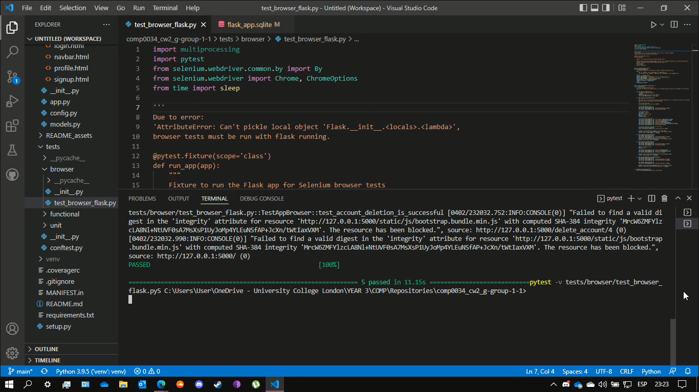

# COMP0034 Coursework 2 - Group 1 Repository

## Summary

ImpactMap is a Flask app developed by Group 1 that uses a NASA dataset about meteorites to map and visualise geographical, contextual, and other scientific data in a series of plotly graphs and illustrations.

This readme contains information about Impact Map, including:

* the repository link
* the set-up instructions
* the base and additional features
* the tests for the web app

## Repository Link

[COMP0034 - Group 1 - CW2](https://github.com/ucl-comp0035/comp0034_cw2_g-group-1-1)

## Set-Up Instructions

1. Refer to [requirements.txt](requirements.txt) for required packages to download.

2. Run the app using the terminal and typing **'python -m flask_app.app'**.

## Features

The app contains required features as well as some additional features, which are listed below:

### Base Features

* Responsive design
* Dash app can be launched through the web app
* Users can sign up, log in, and log out
* App content is restricted to users that have signed up
* Data entries by users are stored
* Data is stored in a SQLite database which is displayed

### Additional Features

* Dash app navbar

> Allows for ease of access between routes

* Email integration

> For account verification

* User profiles

> With option to change password

## Testing

Most of the testing was carried out without issue. Github Actions was used to conduct these tests, excluding dash app files using the **.coveragerc** file.

However, browser tests encountered an unknown error and as such were conducted manually. See video below as proof of working test:

> Browser testing proof:

